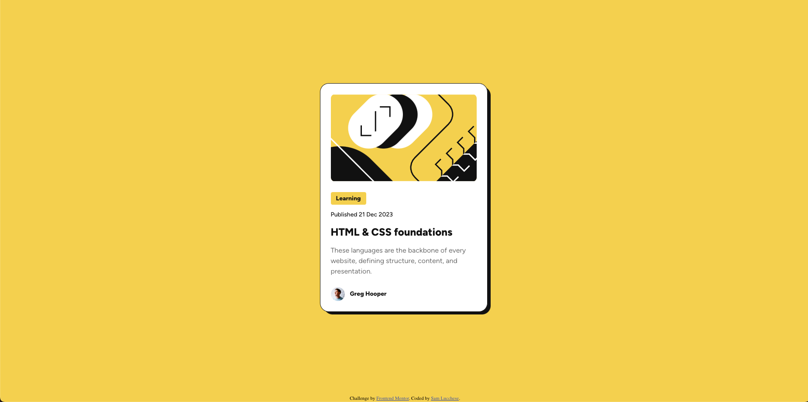
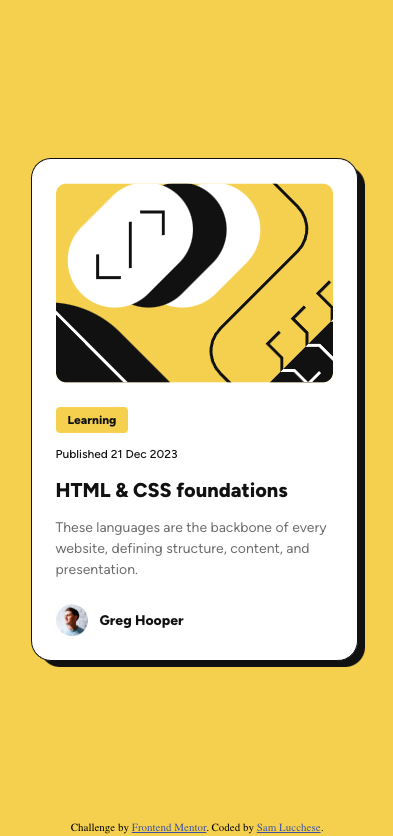

# Frontend Mentor - Blog preview card solution

This is a solution to the [Blog preview card challenge on Frontend Mentor](https://www.frontendmentor.io/challenges/blog-preview-card-ckPaj01IcS). Frontend Mentor challenges help you improve your coding skills by building realistic projects. 

## Table of contents

- [Overview](#overview)
  - [The challenge](#the-challenge)
  - [Screenshot](#screenshot)
  - [Links](#links)
- [My process](#my-process)
  - [Built with](#built-with)
  - [What I learned](#what-i-learned)
  - [Continued development](#continued-development)
  - [Useful resources](#useful-resources)
- [Author](#author)

## Overview

### The challenge

Users should be able to:

- See hover and focus states for all interactive elements on the page

### Screenshot

### Links

- Solution URL: [https://www.frontendmentor.io/solutions/blog-preview-card-with-hover-state-H5t9h_9EEp](https://www.frontendmentor.io/solutions/blog-preview-card-with-hover-state-H5t9h_9EEp)
- Live Site URL: [https://samlucchese.github.io/Blog-Preview-Card/](https://samlucchese.github.io/Blog-Preview-Card/)

## My process

1. Analyze the design guidelines
2. Clone gulp-template
4. Set up HTML file with classes, links, and image files, set up structure
5. Add specific styling based on the design file

### Built with

- Semantic HTML5 markup
- SCSS
- Flexbox
- gulp

## Author

- Frontend Mentor - [@samlucchese](https://www.frontendmentor.io/profile/samlucchese)
- LinkedIn - 

